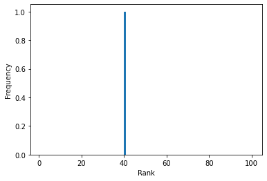
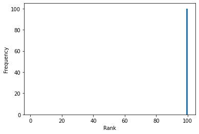
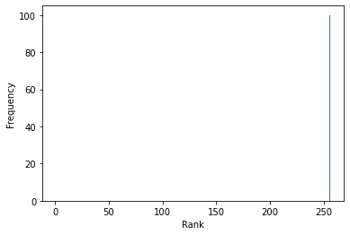
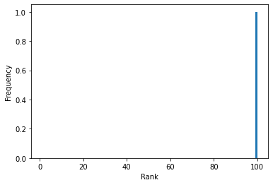

## MoreLoRA

Author: kirp

Data: 21/4/2023

Update:  24/4/2023

### Idea:

##### Original LoRA:

$W = W_0 + UV^T$ and $rank(UV^T)\leq r$

We can do more than that.

##### Initialization:

$W = W_0 - U_0{V_0}^T + UV^T$

##### Additive LoRA:

$W = W_0 + UI_{r(1\times \frac{n}{r})}+I_{r(\frac{m}{r}\times 1)}V^T$ where $U\in \mathbb{R}^{m\times r}, V\in{\mathbb{R}^{n \times r}}$ and $rank(UV^T)\leq 2r$

##### Analysis of the rank property：

- $(m,n)=(100,100),r=10,\Delta=UI_{r(1\times \frac{n}{r})}+I_{r(\frac{m}{r}\times 1)}V^T$

  ```
  trainable: 4000, partion: 0.4
  r = 20, estimate rank of delta: 40
  ```

  

  <p align="center">
  </a>
  </p>

##### Hadamard LoRA:

$W = W_0 + UV^T$ and $rank(UV^T)\leq r$. 

$W = W_0 + (U_1V_1^T)\odot(U_2V_2^T)$ where $U=[U_1, U_2]\in \mathbb{R}^{m\times r}, V=[V_1,V_2]\in{\mathbb{R}^{n \times r}}$ and $rank( (U_1V_1^T)\odot(U_2V_2^T))\leq r^2/4$. 

$W = W_0 + (U_1V_1^T)\odot(U_2V_2^T)\odot(U_3V_3^T)$ where $U=[U_1, U_2, U_3]\in \mathbb{R}^{m\times r}, V=[V_1,V_2, V_3]\in{\mathbb{R}^{n \times r}}$ and $rank((U_1V_1^T)\odot(U_2V_2^T)\odot(U_3V_3^T))\leq (\frac{r}{3})^3$

$W = W_0 + \odot_{i=1}^{i=k}(U_iV_i^T)$ where $U=[U_1,\cdots,U_k]\in\mathbb{R}^{m\times r}$, $V=[V_1,\cdots,V_k]\in\mathbb{R}^{n\times r}$ and $rank(\odot_{i=1}^{i=k}(U_iV_i^T))\leq (\frac{r}{k})^k$

<p align="center">
</a>
</p>
##### Analysis of the rank property

- $r=15,k=3,\Delta= \odot_{i=1}^{i=k}(U_iV_i^T)\in\mathbb{R}^{100 \times 100},X_i\in\mathbb{R}^{100\times 5},Y_i\in\mathbb{R}^{100\times 5}$

  ```
  trainable: 3000, partion: 0.3
  r=15, estimate rank of delta: 100
  ```

  <p align="center">
  </a>
  </p>

- $r=16,k=4,\Delta= \odot_{i=1}^{i=k}(U_iV_i^T)\in\mathbb{R}^{768 \times 1024},X_i\in\mathbb{R}^{768\times 4},Y_i\in\mathbb{R}^{1024\times 4}$

  ```
  trainable: 28672, partion: 0.036458333333333336
  r=16, estimate rank of delta: 256
  ```

  <p align="center">
  </a>
  </p>

##### Hadamard LoRA: non-linear activation or Regulization

$\Delta = \odot_{i=1}^{i=k}(\tanh(U_iV_i^T))$ It's odd, the tanh has such power.

```
trainable: 600, partion: 0.06
r=3, k=1, regularization:True, estimate rank of delta: 3
```

<p align="center">
</a>
</p>

$\Delta = \odot_{i=1}^{i=k}(\sigma(U_iV_i^T)) $

##### Complexity analysis:


### Todo:

- Estimate the computation cost
- Learn from PEFT, LoRA and AdaLoRA
- Initialization $W = W_0 - U_0{V_0}^T + UV^T$
- Substitute multiplication by addition
- Support DeepSpeed

### Reference:

```bibtex
@online{kexuefm-9590,
    title={梯度视角下的LoRA：简介、分析、猜测及推广},
    author={苏剑林},
    year={2023},
    month={Apr},
    url={\url{https://spaces.ac.cn/archives/9590}},
}
```

```bibtex
@misc{hyeonwoo2023fedpara,
      title={FedPara: Low-Rank Hadamard Product for Communication-Efficient Federated Learning}, 
      author={Nam Hyeon-Woo and Moon Ye-Bin and Tae-Hyun Oh},
      year={2023},
      eprint={2108.06098},
      archivePrefix={arXiv},
      primaryClass={cs.LG}
}
```

