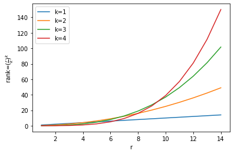

## MoreLoRA

Author: kirp

Data: 21/4/2023

Update:  24/4/2023

### Idea:

##### Original LoRA:

$W = W_0 + UV^T$ and $rank(UV^T)\leq r$

We can do more than that.

##### Initialization:

$W = W_0 - U_0{V_0}^T + UV^T$

##### Additive LoRA:

$W = W_0 + UI_{r(1\times \frac{n}{r})}+I_{r(\frac{m}{r}\times 1)}V^T$ where $U\in \R^{m\times r}, V\in{\R^{n \times r}}$ and $rank(UV^T)\leq 2r$. 

##### Hadamard LoRA:

$W = W_0 + UV^T$ and $rank(UV^T)\leq r$. 

$W = W_0 + (U_1V_1^T)\odot(U_2V_2^T)$ where $U=[U_1, U_2]\in \R^{m\times r}, V=[V_1,V_2]\in{\R^{n \times r}}$ and $rank( (U_1V_1^T)\odot(U_2V_2^T))\leq r^2/4$. 

$W = W_0 + (U_1V_1^T)\odot(U_2V_2^T)\odot(U_3V_3^T)$ where $U=[U_1, U_2, U_3]\in \R^{m\times r}, V=[V_1,V_2, V_3]\in{\R^{n \times r}}$ and $rank((U_1V_1^T)\odot(U_2V_2^T)\odot(U_3V_3^T))\leq (\frac{r}{3})^3$. 

$W = W_0 + \odot_{i=1}^{i=k}(U_iV_i^T)$ where $[U_i]_{i=1 \cdots k}=U \in \R^{m\times r}$, $[V_i]_{i=i\cdots k} = V \in{\R^{n \times r}}$ and $rank(\odot_{i=1}^{i=k}(U_iV_i^T))\leq (\frac{r}{k})^k$. 


<p align="center">
</a>
</p>

### Todo:

- Learn from PEFT, LoRA and AdaLoRA
- Derive the methods
- Initialization $W = W_0 - U_0{V_0}^T + UV^T$
- Substitute multiplication by addition
- Estimate the computation cost
- Support Deepspeed

### Reference:

```bibtex
@online{kexuefm-9590,
    title={梯度视角下的LoRA：简介、分析、猜测及推广},
    author={苏剑林},
    year={2023},
    month={Apr},
    url={\url{https://spaces.ac.cn/archives/9590}},
}
```

```bibtex
@misc{hyeonwoo2023fedpara,
      title={FedPara: Low-Rank Hadamard Product for Communication-Efficient Federated Learning}, 
      author={Nam Hyeon-Woo and Moon Ye-Bin and Tae-Hyun Oh},
      year={2023},
      eprint={2108.06098},
      archivePrefix={arXiv},
      primaryClass={cs.LG}
}
```

